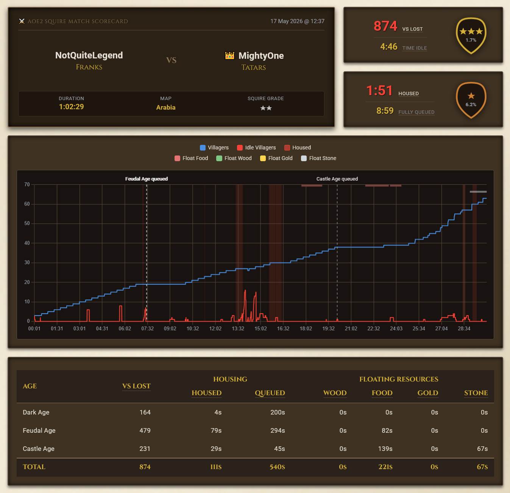
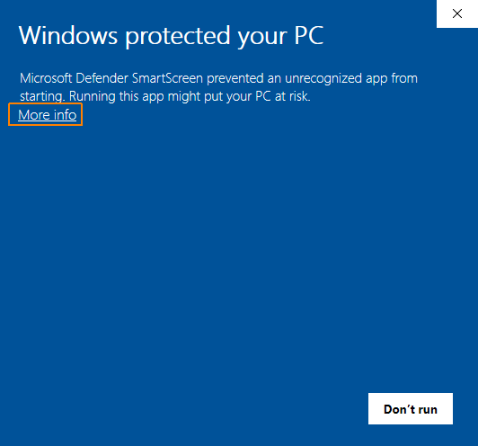
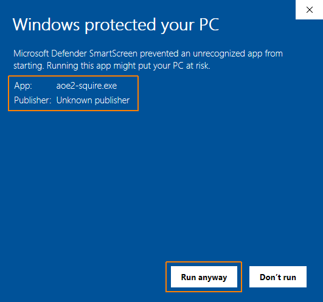

# AoE2 Squire


[⬇ Latest Release](https://github.com/chris-h-sg/aoe2-squire/releases/latest) · [💬 Discord](https://discord.gg/A9QXpDUHX)

---

AoE2 Squire is a free, zero-install match analyzer for **Age of Empires II: Definitive Edition** that runs in the background while you play. When your match ends, your squire gets to work, creating a report showing exactly where you can improve. No uploading files, no viewing replays, no configuration required.

<a href="assets/report-sample.png"></a>

This report shows how the player NotQuiteLegend is managing their idle villagers well (★★★, red line in the chart) but got housed multiple times (★, red overlays) and didn't keep up consistent villager villager production (blue line). They floated a lot of food in late Feudal and early Castle Age (red bar at the top).

---

## What It Tracks

  - **Idle Villagers:** Gather time lost due to idle villagers.
  - **Housing Efficiency:** Time spent population-blocked or with units queued while close the housing limit.
  - **Villager Graph:** Your villager count over time, showing when you stopped producing or lost villagers.
  - **Floating Resources:** Periods where you stockpiled resources too long. Ignores intentional saving up for aging up or castles.

---

## Getting Started

### System Requirements
*   **Operating System**: Windows 10 or 11
*   **Game:** Age of Empires II: Definitive Edition
*   **Display**: 1366×768 or higher, game running on primary monitor

### Setup

1. Go to the **[Releases page](https://github.com/chris-h-sg/aoe2-squire/releases/latest)** and download `aoe2-squire.exe`
2. Place it anywhere on your computer, no installation needed
3. Run it before starting a match

<details>
<summary><b>Getting a Windows SmartScreen warning?</b></summary>

After downloading AoE2 Squire, Windows SmartScreen might stop it from running because it's not signed by Microsoft.

1. When you see the warning, click on **More info**.

   

2. Verify that the Publisher is listed as **Unknown Publisher**. 
   * **Important:** If it shows anything else, do not run the file, as it could be malware!
   * If it shows "Unknown Publisher", it simply means the file isn't signed by Microsoft. Click **Run anyway** to start AoE2 Squire.

   
</details>

### How to Use

1. **Start the Squire:** Run `aoe2-squire.exe` before you start your match, with or without the game already running
2. **Play normally:** Your squire observes from the sidelines, taking notes of how the match unfolds
3. **View your report:** When the match ends, your squire presents your post-match report in your browser and automatically waits for your next match

---

## Known Limitations

| Issue | Detail |
|-------|--------|
| **Pausing** | Breaks sync between visual clock and replay timeline |
| **Alt-Tab / Minimize** | Interrupts visual data collection |
| **UI Mods** | Only `Anne_HK - Better Resource Panel and Idle Villager Icon` is currently supported |
| **Replay POV** | Analysis is based on the point of view the replay was recorded from |

---

## FAQ

**Is it safe to use? Will I get banned?**
Yes. AoE2 Squire only reads your screen visually to track the resource bar and population counter. It never hooks into game memory, modifies files, or interacts with game processes. There is zero risk of an anti-cheat ban.

**Does it work offline?**
Yes. Everything is bundled inside the single `.exe`, no internet connection required.

**Which resolutions are supported?**
Any resolution of 1366×768 or higher, running on your primary monitor.

**What if it can't find my replay file?**
A window will appear asking you to select the file manually. If you don't select a replay file, the Squire will generate a report using collected real-time data only.

---

## Community & Feedback

Got a bug, feature request, or feedback for your squire?

[💬 Join the Discord](https://discord.gg/A9QXpDUHX)

---

## Developer Guide

AoE2 Squire uses a **"Hybrid Data Strategy"**:
1. **Screen Scraping:** Records the "Current State" (resources, idle counts) while the game runs.
2. **Replay Parsing:** Reads the game events (unit and tech timings) from the `.aoe2record` file after the match ends.
3. **Data Meshing:** Combines both timelines to find efficiency gaps (e.g. stockpiling resources but not clicking up to age).

### Building from Source

The core is written in Rust.

```bash
# Build the standalone binary
cargo build --release
# Output: target/release/aoe2-squire.exe
```

### Development Workflows

```bash
# Run the background orchestrator
cargo run --release

# Run with detailed logs
cargo run --release -- --verbose

# Analyze an existing CSV + replay file
cargo run -- --analyze "path/to/telemetry.csv" "path/to/match.aoe2record"

# Build merged data file, then run specific analyzers
cargo run --bin mesher "path/to/telemetry.csv" "path/to/match.aoe2record"
cargo run --bin idle_analyzer -- --verbose
cargo run --bin housing_analyzer
cargo run --bin floating_analyzer

# Extract raw events from a replay
cargo run -- --parse-replay "path/to/match.aoe2record"

# Test vision pipeline on a screenshot
cargo run -- "test_bench/aoe2_16x9.png"
```

Further reading: [`DECISION_LOG.md`](DECISION_LOG.md) · [`TECHNICAL_SPEC.md`](TECHNICAL_SPEC.md) · [`LOW_ELO_ISSUES.md`](LOW_ELO_ISSUES.md)

---

## Data Acknowledgements
This project uses community data from:
*   **Unit Statistics**: [unitstatistics.com](https://unitstatistics.com/age-of-empires2/)
*   **Object & Tech Tables**: [airef.github.io](https://airef.github.io/tables/objects.html)
*   **Halfon Data**: [halfon.aoe2.se](https://halfon.aoe2.se/) · [SiegeEngineers/halfon](https://github.com/SiegeEngineers/halfon)

## License

This project is licensed under the MIT License - see the [LICENSE](LICENSE) file for details.
